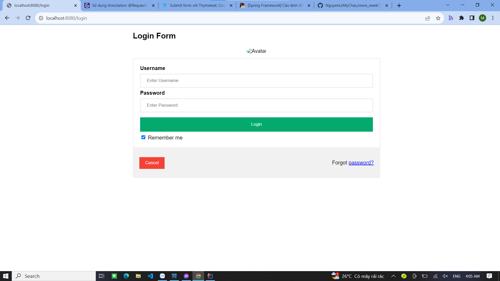
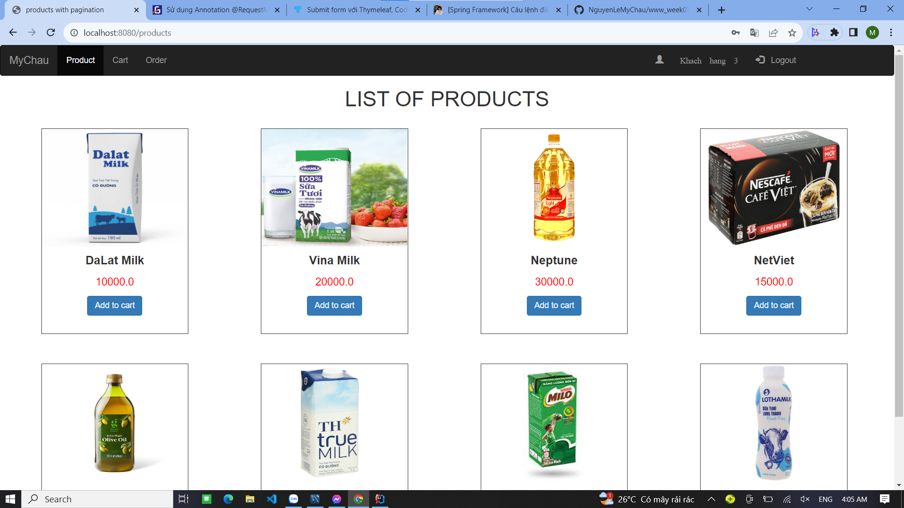
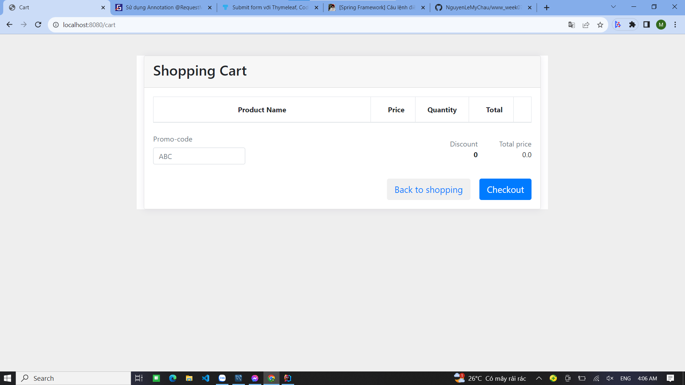
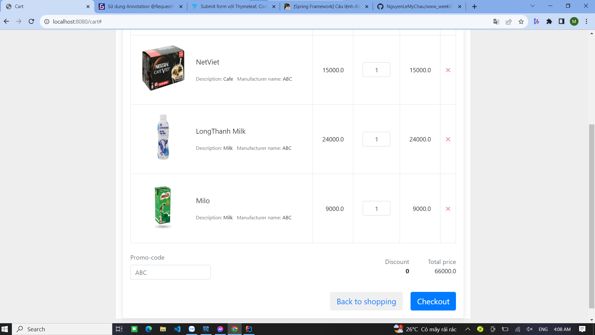

1. Hiển thị products trong trạng thái chưa login

2. Nhấn vào login hiển thị form login

3. Sau khi login thành công -> hiển thị trang products cùng tên của khách hàng vừa đăng nhập

4. Click vào Cart trên thanh nav -> đây là giỏ hàng khi chưa add sản phẩm

5. Nhấn Back to shopping để quay lại trang products. Chọn sản phẩm cần thêm

6. Hiển thị các sản phẩm và nhấn Checkout để tiến hành thanh toán -> Sau khi nhấn uay lại trang products và giỏ hàng được làm mới
7. Nhấn logout để trở lại đăng xuất

